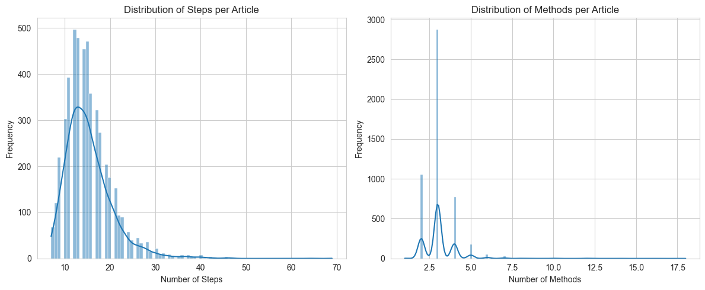
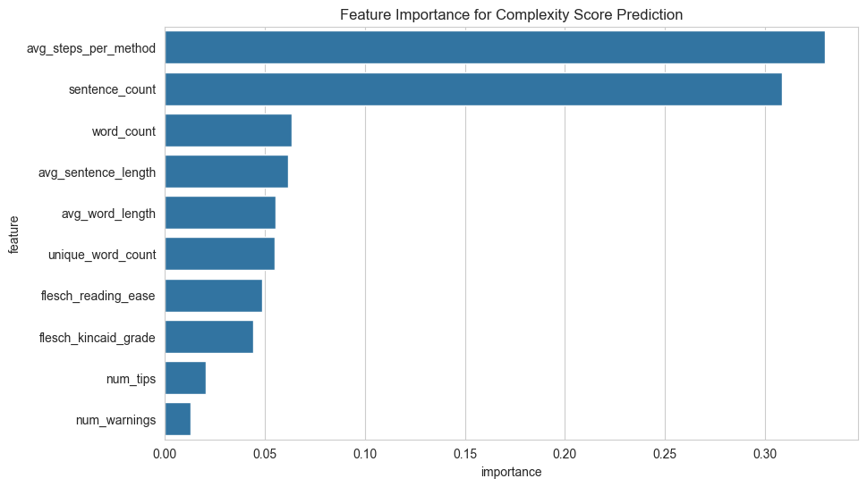
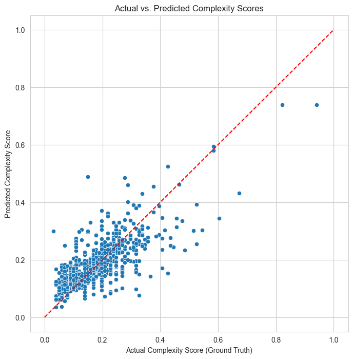

# Instruction Complexity Analyzer

## Project Overview

For individuals with executive function challenges like ADHD or cognitive fog, initiating a task from a complex set of instructions can be a significant barrier. This project, the **Instruction Complexity Analyzer**, serves as an AI-powered "cognitive ramp" to address this accessibility issue.

The tool analyzes any given instructional text and predicts a "complexity score." This allows a user to gauge the mental energy required for a task *before* they begin, helping them to better manage their time, set expectations, and approach new tasks with more confidence.

---

## Data Visualizations

These visualizations tell the story of our data and our model's performance.

**1. Exploratory Data Analysis**
*These histograms show the distribution of steps and methods in our 5,000-article dataset. We observed that most articles are moderately complex, with a long tail of more complex instructions, which is ideal for training.*


**2. Feature Importance**
*This plot reveals our final model's strategy. It learned that the instruction's structure (average steps per method) and its overall volume (sentence and word counts) are the most powerful predictors of complexity.*


**3. Model Performance: Actual vs. Predicted**
*This scatter plot visualizes our model's high accuracy. The tight clustering of predictions around the red "perfect prediction" line confirms the model's reliability.*


---

## Technologies Used

* **Python:** Primary programming language
* **Pandas & NumPy:** Data manipulation and analysis
* **Scikit-learn:** For training and evaluating regression models
* **Textstat:** For calculating readability scores
* **Matplotlib & Seaborn:** For data visualization
* **Streamlit:** For building and deploying the interactive demo

---

## The Machine Learning Pipeline

Our project followed a standard, rigorous machine learning workflow:

1.  **Data Sourcing & Preparation:** We used a dataset of wikiHow articles and created a working subset of 5,000 articles.
2.  **Feature Engineering:** We converted the raw text of each article into a rich numerical feature set of over 10 linguistic and structural metrics.
3.  **Model Training & Tuning:** We trained and compared multiple regression models (Linear, Lasso, Ridge, Random Forest, Gradient Boosting). We then performed hyperparameter tuning on the top performers to find the optimal settings.
4.  **Evaluation:** We selected our final model based on its performance on a held-out test set, using Root Mean Squared Error (RMSE) as our primary metric.

## Model Performance

After comparing multiple models, our final **Tuned Gradient Boosting Regressor** was the clear champion. It achieved a **Root Mean Squared Error (RMSE) of 0.0584** on the test set, indicating a very high degree of accuracy.

---

## How to Run the Demo

An interactive demo of this project has been deployed using Streamlit. To run it locally, follow these steps:

1.  **Clone the repository:**
    ```bash
    git clone [https://github.com/your-username/your-repo-name.git](https://github.com/your-username/your-repo-name.git)
    cd your-repo-name
    ```
2.  **Install dependencies:**
    ```bash
    pip install -r requirements.txt
    ```
3.  **Run the Streamlit app:**
    ```bash
    streamlit run app.py
    ```

---

## Data Source & Acknowledgments

* **Primary Dataset:** The [wikiHow All Dataset](https://www.kaggle.com/datasets/aniketsharma00411/wikihow-raw-data/data) from Kaggle was used as the source for all instructional articles.
* This project was developed as part of the **AI4ALL Ignite Program**.
